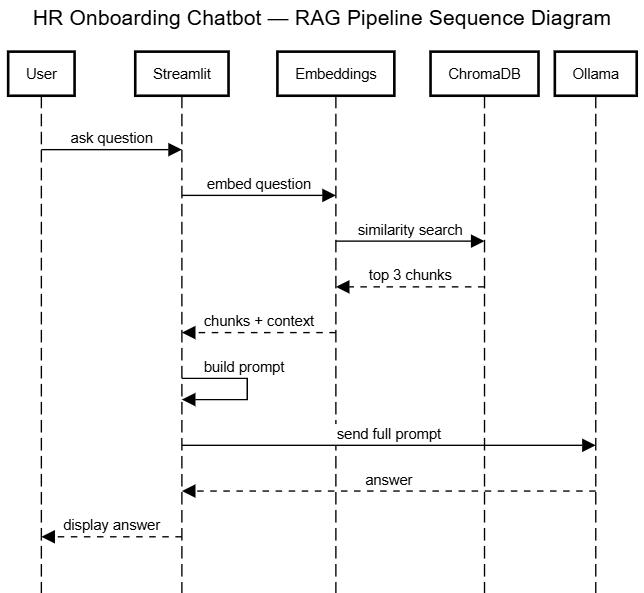

# 🏢 HR Onboarding Assistant — AI Chatbot

An AI-powered chatbot that answers employee questions about HR policies, leave, attendance, and onboarding — using your actual company document, not the internet.

---

## What it does

Employees can ask questions like:
- *"How many sick leaves do I get?"*
- *"What is the attendance policy?"*
- *"How do I apply for leave?"*

The bot answers instantly based on the company's HR policy document.

---

## How it works (RAG Pipeline)

This project uses **RAG (Retrieval-Augmented Generation)** — a technique where the AI reads only the relevant parts of your document before answering.



**Step by step:**
1. The HR policy PDF is split into small chunks and stored in a database
2. When a user asks a question, the most relevant chunks are retrieved
3. Those chunks are sent to the AI along with the question
4. The AI generates an answer based only on those chunks

---

## Tech Stack

| Tool | Purpose |
|---|---|
| **Streamlit** | Chat UI |
| **Ollama + LLaMA 3.1** | Local LLM — generates answers |
| **ChromaDB** | Vector database — stores and searches chunks |
| **HuggingFace all-MiniLM-L6-v2** | Embedding model — converts text to vectors |
| **LangChain** | Framework — connects all components |

---

## 📁 Project Structure

```
mybot/
│
├── app.py              # Main Streamlit app
├── docs/
│   └── hr_policy.pdf   # HR policy document
├── chroma_db/          # Vector database (auto-generated)
└── README.md
```

---

## How to run locally

### 1. Clone the repository
```bash
git clone https://github.com/your-username/your-repo-name.git
cd your-repo-name
```

### 2. Install dependencies
```bash
pip install streamlit langchain langchain-community langchain-huggingface langchain-ollama chromadb sentence-transformers pypdf
```

### 3. Install and run Ollama
- Download from [ollama.com](https://ollama.com)
- Pull the model:
```bash
ollama pull llama3.1
```

### 4. Run the app
```bash
python -m streamlit run app.py
```

---

## Features

- Answers HR policy questions from the actual company document
- Remembers conversation history within a session
- Falls back gracefully when it doesn't know the answer
- Runs completely locally — no API key needed
- Safe: never approves/rejects leave or handles personal cases

---

## ⚠️ Limitations

- Only answers from the provided HR policy PDF
- Requires Ollama running in the background
- Cannot be deployed on Streamlit Cloud (local model)
